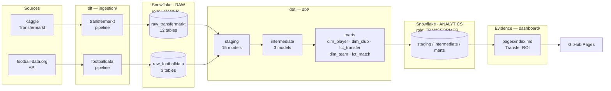
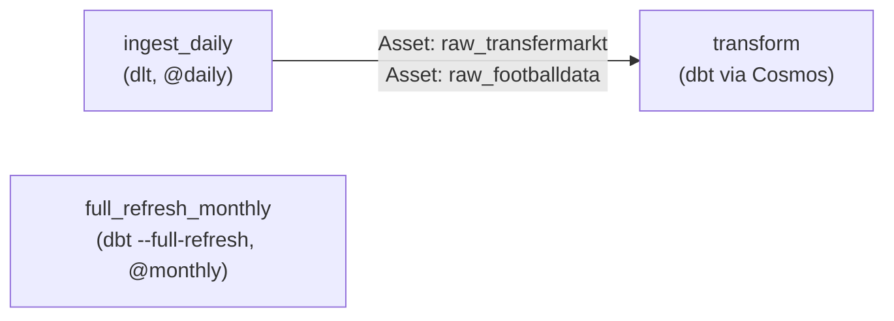

# Architecture

This document explains how Mercato Analytics fits together and, more importantly,
*why* it's built this way — the design decisions below came out of real constraints
hit while building the project, not upfront theorizing. For conventions and
day-to-day commands, see [`CLAUDE.md`](./CLAUDE.md) and each module's own README.

## System overview



Both `PIPELINE_SVC` roles (`LOADER`, `TRANSFORMER`) are the same Snowflake
**SERVICE** user — least privilege is enforced by which role is active on a given
connection, not by which user connects (see decision 2 below).

## Orchestration

Three Airflow DAGs (Astronomer, `orchestration/dags/`), scheduled with
[Asset](https://airflow.apache.org/docs/apache-airflow/stable/authoring-and-scheduling/assets.html)-based
data-awareness rather than fixed times chained together:



`transform`'s task graph is generated entirely from the dbt project's
`ref()`/`source()` lineage by Cosmos — no hand-written task ordering.
`full_refresh_monthly` exists for when a mart eventually goes `incremental`; nothing
currently needs it.

## CI/CD

- **`.github/workflows/ci.yml`** — on every PR: `sqlfluff lint` then `dbt build
  --target ci`, both against live Snowflake (as `PIPELINE_SVC`).
- **`.github/workflows/deploy-dashboard.yml`** — on push to `main` touching
  `dashboard/**`: rebuilds the Evidence site against live data and publishes to
  GitHub Pages.

## Key design decisions

### 1. ROI transfert: separate indicators, not one score

`fct_transfer` exposes `roi_financier` (market-value gain during the spell,
relative to the fee paid), `value_gained_absolute` (the same gain in euros,
unconditional on fee), and `cost_per_goal_contribution` (fee paid relative to
goals + assists) as **separate columns**, not blended into one weighted score.

**Why:** merging money and sporting performance into a single number needs an
arbitrary weighting scheme (why 60/40 and not 50/50?) that's hard to justify and
impossible to unit-test meaningfully. Independent numbers stay individually
interpretable, and each has a precise, testable formula — see the dbt unit tests
in `dbt/models/marts/_marts__unit_tests.yml`.

`value_gained_absolute` exists because `roi_financier` is a *ratio*, and a ratio
is undefined at zero cost — it was silently excluding every `fee = €0` transfer
from any financial view, real "great free transfer" stories included (Toni Kroos
to Bayern Munich, Jan Vertonghen to Ajax). At the time this was written, the
transfermarkt-datasets docs' claim that `transfer_fee` is "null if unknown, 0 if
free transfer" was taken at face value; decision 12 below found that `0` is
actually an upstream parsing catch-all (loans and unparsed fee formats collapse
into it too, not just genuine free transfers) — so `value_gained_absolute` is
best read as "value gained on a transfer with no confirmed fee," not strictly
"on a free transfer." It's still a subtraction, not a ratio, so it stays defined
at fee = 0 either way; see the dashboard's *Best free transfers* section.

### 2. Snowflake auth: key-pair + a dedicated SERVICE user

Every pipeline (dlt, dbt, Airflow, Evidence) authenticates as `PIPELINE_SVC`
(`TYPE = SERVICE`, RSA key only — Snowflake doesn't allow a password on a SERVICE
user at all), never as the personal account.

**Why:** the Snowflake trial enforces MFA on password logins, which blocks
password-based automation outright. Key-pair auth was the fix — but it was
initially attached to the personal person account, which Snowflake's own Trust
Center later flagged as a "person user, password-only auth" risk (the real
problem: mixing a human identity with an automation identity). A dedicated SERVICE
user is Snowflake's documented pattern for exactly this, and structurally can't
regress into password auth. See `snowflake/setup.sql`.

### 3. dbt orchestrated via Cosmos-in-Airflow, not dbt Cloud

dbt runs locally (interactive dev) and via
[Cosmos](https://astronomer.github.io/astronomer-cosmos/) inside self-hosted
Airflow — no dbt Cloud account.

**Why:** portfolio scope. dbt Cloud is a fine choice generally, but adding a second
managed SaaS here wouldn't demonstrate anything Cosmos doesn't already cover, and
building the Cosmos integration directly is more instructive for a project meant to
show modern-data-stack orchestration, not just consume it.

### 4. Freshness on dlt sources without a `loaded_at` column

Every source's freshness check uses
`loaded_at_field: to_timestamp_ntz(_dlt_load_id::number(38,0))` instead of a
dedicated timestamp column.

**Why:** dlt stores its internal load id as a stringified Unix epoch
(`_dlt_load_id`), not a human timestamp column, and none of the source tables carry
their own `loaded_at`. Casting the load id directly gives correct freshness checks
without adding a redundant column anywhere. See any `_*__sources.yml` under
`dbt/models/staging/`.

### 5. No identity resolution between Transfermarkt and football-data.org

`dim_club` (Transfermarkt) and `dim_team` (football-data.org) are two separate,
unlinked referentials for what are sometimes the same real-world clubs.

**Why:** fuzzy-matching club (and eventually player) names across sources
correctly is a project of its own — normalizing "Bayern Munich" vs "FC Bayern
München" vs "Bayern München" reliably needs real work, and a half-done match would
silently corrupt joins rather than just being absent. Neither source blocks the
other for the current ROI use case, so this is deliberately deferred rather than
rushed.

### 6. FBref abandoned

There's no `ingestion/fbref/pipeline.py`, despite FBref being in the original
source list.

**Why:** FBref serves an interactive Cloudflare challenge (Turnstile) to every
automated request — confirmed independent of network/IP (tested from a residential
IP, not a datacenter range). Defeating it would mean deliberately circumventing an
active anti-bot measure on a site whose terms of service explicitly forbid
scraping. See `ingestion/fbref/README.md`.

### 7. Evidence: extract-then-cache, and a base-path gotcha

Each mart table the dashboard uses needs its own extraction file
(`dashboard/sources/mercato_analytics/<table>.sql`, e.g. `select * from
fct_transfer`). `npm run sources`/`build` runs these against live Snowflake and
caches the result as local parquet; **page queries run against that cache**, not
Snowflake directly at page-load time. Separately, `dashboard/evidence.config.yaml`
sets `deployment.basePath: /mercato-analytics`.

**Why:** this is simply how Evidence works (extract at build time, query the cache
client-side via DuckDB-wasm) — but it's not obvious from a page's markdown alone,
and skipping either piece fails silently and confusingly: no extraction file means
every page query 404s against an empty local DuckDB catalog; no base path means
GitHub Pages (which serves the site under `/mercato-analytics/`, not the domain
root) loads an unstyled page stuck on "Loading..." because every asset URL is
missing its prefix. Both were hit for real, not anticipated in advance.

The base-path fix has its own sharp edge: it works by a preprocessor doing a naive
text regex over every `href=`/`src=` in a page's raw markdown, *before* Svelte
evaluates any `{expression}` — so a hand-written `` gets its
literal, unevaluated `{someUrl}` text prefixed with `/mercato-analytics/`, breaking
even fully-external URLs at runtime (`/mercato-analytics/https://...`). Evidence's
own `<Image url={someUrl}>` component sidesteps this because `url` isn't a name the
regex matches, and its internal `` lives inside a compiled `.svelte` file
the preprocessor never touches (it only runs on `+page.md`). Rule of thumb: use
`<Image>` for any dynamic/external image in a page, never a raw ``.

### 9. Club crests derived from `club_id`, no new source needed

`dim_club.crest_url` is `https://tmssl.akamaized.net/images/wappen/tiny/{club_id}.png`
— Transfermarkt's own crest CDN, keyed directly by the `club_id` already in every
transfermarkt table.

**Why:** there's no crest/logo field anywhere in the Kaggle dataset's tables, and
resolving club identity against football-data.org's `dim_team` (which does have a
`crest` field) would mean doing the cross-source identity resolution decision 5
explicitly avoids. The CDN pattern is undocumented but stable and public — verified
against real `club_id`s (Sevilla FC, PSG) before relying on it, same bar as any
other external dependency here.

### 10. Commercial value is out of scope, on purpose

`fct_transfer` has no column for shirt sales, sponsorship, or social-media reach —
a player's commercial pull is a real part of why some transfers happen, but it
isn't in this model at all.

**Why:** none of this project's sources publish player-level commercial figures
(Transfermarkt and football-data.org are both sporting/transfer data). The
platforms that do model this — FootballTransfers/SciSports (ETV), CIES Football
Observatory — are enterprise or paid-subscription only, no self-serve API, checked
directly before ruling them out rather than assumed. Inventing a proxy metric with
no real data behind it would be worse than being explicit about the gap, so the
dashboard says so in its intro rather than pretending `roi_financier` is a complete
picture.

### 8. Each CI job needs its own `dbt deps`

Both the `sqlfluff` and `dbt-build` jobs in `ci.yml` run `dbt deps`, even though
that looks redundant.

**Why:** each GitHub Actions job runs on its own fresh runner — packages
(`dbt_utils`) installed in one job's `dbt_packages/` don't exist in the other's.
Found by actually running the pipeline in a real PR (`dbt build` failed with "dbt
expects 1 package(s) ... found only 0"), not by inspection.

### 11. `dbt` schema isolation is enforced by target name, not convention

`dbt/macros/generate_schema_name.sql` only gives a model the bare
staging/intermediate/marts schema when `target.name == 'prod'`. Every other target
(local `dev`, CI's `ci`) gets its models built into a target-prefixed schema instead
(`dbt_marts`, `ci_marts`, ...). Local `~/.dbt/profiles.yml` defaults to `dev`;
`.github/dbt_profiles/profiles.yml` is pinned to `ci`; `orchestration/include/dbt_profiles/profiles.yml`
(used by Cosmos/Airflow) is pinned to `prod`, since the scheduled `transform` DAG is
the intended long-term owner of the production schema.

**Why:** found by inspection that local `dev` runs, CI's `dbt build` (on every PR,
before merge), and the Airflow profile were all writing into the exact same
`ANALYTICS.marts` schema the live Evidence dashboard reads from — there was no
environment separation at all, despite `CLAUDE.md` already stating CI should run
"on a dev environment." A bad local `dbt run` or an untrusted PR's CI check could
silently overwrite what the public dashboard shows. Until the Airflow `transform`
DAG is actually deployed to Astronomer, publishing a dbt change to production is a
deliberate `dbt build --target prod` run — not automatic. This matches how most
teams keep CI/dev from touching prod without owning a second Snowflake account or
database: same warehouse and role, isolated by schema and by which target name is
allowed to resolve to the bare schema.

### 12. `transfer_fee = 0` is not a reliable "confirmed free transfer" signal

Traced this past "the data looks sparse" to an actual upstream bug, not just a
correlation. `transfermarkt-datasets`' own transform
([`base_transfers.sql`](https://github.com/dcaribou/transfermarkt-datasets/blob/master/dbt/models/base/transfermarkt_api/base_transfers.sql),
still present on `master` as of this check) parses the raw fee text with:

```sql
case
    when transfer_fee in ('-', '?', '') or transfer_fee is null then null
    when transfer_fee = 'free transfer' then 0
    when left(transfer_fee, 1) = '€' then ... -- parses "€2.00m" etc.
    else 0                                    -- <- catches everything else
end
```

That `else 0` silently collapses *any* fee text that isn't exactly `€X.Xm`/`€X.Xk` —
`"Loan fee: €2.00m"`, plain `"Loan"`, `"End of loan"`, non-euro-denominated fees —
into the same `0` used for a genuine free transfer. The two cases are
indistinguishable downstream, in both the Kaggle CSV and our warehouse; the raw
pre-parse text isn't published, so there's no way to recover which is which on our
end. This directly contradicts the source's own docs, which claim `0` means
"confirmed free transfer" as a clean, reliable signal — checked and it isn't one.

**Why this matters:** every `transfer_fee = 0` row (`value_gained_absolute`, the
*Best free transfers* dashboard section, and the near-zero fee rate in the "Current
transfer window" section) is now understood as "free transfer, loan, or unparsed fee
text" rather than definitively "free." Confirmed independently that even fully
concluded seasons only carry a non-zero fee on a small minority of transfers (25/26:
4.7%, 24/25: 5.9%, 23/24: 6.3%) and that Snowflake already has the latest published
Kaggle version (673, 2026-07-11) — so this isn't a staleness issue, and not something
fixable in our own pipeline; it's an upstream bug worth flagging to
`dcaribou/transfermarkt-datasets` directly rather than working around silently.

### 13. ClubElo for club strength, with an honest ~70% match rate

`fct_transfer.club_elo_delta` (`to_club_elo - from_club_elo`) measures whether a
transfer was a step up or down in club quality — something neither Transfermarkt
nor football-data.org expresses at all. Sourced from
[ClubElo](http://clubelo.com/) (`ingestion/clubelo/`, free, no auth, European
football only, tracked since 1939).

**Why this matters, and why it's incomplete:** ClubElo doesn't cover South
American, North American (MLS), Asian, or Middle Eastern clubs at all — about a
quarter of `dim_club` can never match, full stop. Worse, ClubElo also uses its own
club naming (abbreviations like "Man City", compound-name splits like "Gladbach"
for Mönchengladbach, transliterations like "Moskva" for Moscow), so there's no
direct key to join on. `dbt/seeds/clubelo_club_mapping.csv` resolves this with
`rapidfuzz.token_set_ratio` on normalized names (country-scoped using
`stg_transfermarkt__competitions`), with real correctness bugs hit and fixed along
the way — worth recording because they'd bite any club-name matcher, not just this
one:

- A naive stopword list that strips generic club-type words (`fc`, `cf`, `club`)
  also stripped **`real`** and **`atletico`**, making "Atlético de Madrid" and
  "Real Madrid" both normalize to just `"madrid"` — a perfect but completely wrong
  match. Fixed by keeping any word that distinguishes otherwise-identical names
  (`real`, `atletico`, `athletic`, `sporting`, `united`, `deportivo`, `racing`...)
  out of the stopword list; only pure legal-entity suffixes get stripped.
- A "substring containment" bonus (for compound names like "Mönchengladbach" vs
  "Gladbach") backfired the same way: "Fortuna Düsseldorf" matched "Fortuna Köln"
  — a different club — because they share the generic word "Fortuna". Removed the
  bonus rather than trying to special-case around it.
- Plain character-similarity scoring (`difflib.SequenceMatcher`) rewards matching
  *length* as much as matching *content*, so "Atlético Madrid" scored higher
  against the wrong reserve-team candidate "Atletico B" than against the correct
  "Atletico". Switched to `rapidfuzz.token_set_ratio` (token-set based, not
  character-position based) and added an explicit guard that a reserve/youth-team
  marker (`b`, `ii`, `u21`...) must match on both sides or not at all.

Even after all that, the automated matcher doesn't recognize acronyms it can't
expand ("QPR" vs "Queens Park Rangers") — a handful of well-known clubs the
algorithm missed or got wrong were fixed via a small, individually-verified
override list rather than tuned around further; scores below 0.75 are left
unmatched rather than guessed. Net result: 560 of 796 clubs (~70%) resolve, all
of them spot-checked, none of them silently wrong as far as this review could
tell — a smaller, correct signal beats a complete, unreliable one, same principle
as decision 12 above.

### 14. Wikipedia patches Transfermarkt's biggest coverage gap — transfermarkt.com scraping was explicitly rejected

Investigating "why don't I see Real Madrid's transfers" led somewhere bigger than
the fee-parsing bug in decision 12: Real Madrid has **zero** transfers recorded in
the Kaggle snapshot since July 2024, while other big clubs (Man Utd, Man City,
PSG) kept getting at least partial 2025-26 updates over the same period — a whole
season-count check confirmed the trend (23/24: 3,889 transfers; 24/25: 3,118;
25/26: 2,135; 26/27 so far: 22, none involving a top-5-league club). This is
inconsistent per-club scraper staleness upstream, not a season-wide cutoff.

**Why not fix it by scraping transfermarkt.com directly?** Checked their
`robots.txt` before writing a line of scraper code — it explicitly lists
`ClaudeBot`, `Claude-SearchBot`, and `anthropic-ai` with `Disallow: /`, alongside
every other major AI crawler (`GPTBot`, `PerplexityBot`, `Deepseek`, `Bytespider`)
and even `wget`. That's not a generic anti-bot measure; it's specifically aimed at
AI-driven automated access. Writing a scraper — even one the user would run
themselves, with a generic user-agent — would circumvent the intent of that
block through a technicality rather than respect it, so this was declined outright
regardless of technical feasibility.

**Wikipedia instead**: checked directly, no Claude/AI-specific disallow, content
is CC-BY-SA-licensed for reuse, and the MediaWiki API (not raw HTML scraping) is
the documented way to access it programmatically.
`ingestion/wikipedia_transfers/pipeline.py` targets big European clubs identified
as unusually stale (`dim_club.current_elo >= 1700` — reuses decision 13's Elo
data — with no Transfermarkt transfer in > 300 days), pulling each one's
"{season} {club} season" page's Transfers tables plus, where a real fee is
plausible, a best-effort regex search of the scoring player's own article.

Club targeting is **dynamic, not a hardcoded list** — `_discover_target_clubs()`
runs that staleness query against `analytics.marts` directly at the start of
every pipeline run, so the target set self-adjusts as Transfermarkt's own
coverage catches up (or falls behind) for a given club, with no list to
maintain by hand. This needed the LOADER role — otherwise RAW-only — granted
read-only access to the `marts` schema specifically for this (see
`snowflake/setup.sql`); turned out LOADER already had that access by the time
this was implemented, for reasons not fully tracked down, but the explicit
grant is kept anyway as the documented, intended permission rather than an
undocumented accident. One real gap this surfaced: a club with no ClubElo match
(decision 13, ~30% of `dim_club`) has a null `current_elo` and can never clear
the `>= 1700` bar, no matter how stale its data gets — which silently excludes
Real Madrid, the exact club that motivated this pipeline, since its own ClubElo
data still hasn't loaded (open issue). Kept as an explicit
`ALWAYS_INCLUDE_CLUBS` addition rather than a silent gap, with a comment to
remove it once the underlying Elo issue is actually fixed.

Real, non-obvious bugs hit and fixed here, each one changing the result from
"silently wrong" to "correct" rather than being cosmetic:

- **Blindly trusting the top search hit was wrong.** Searching "2026–27
  Villarreal CF season" (a page that doesn't exist yet) returned "2026–27 Real
  Madrid CF season" as Wikipedia's #1 hit — a naive caller would have silently
  attributed Real Madrid's transfers to Villarreal. Fixed by requiring the season
  string *and* a distinguishing club-name token to both appear in a candidate's
  title before accepting it, checking the top 3 hits rather than just the first.
- **Wikipedia's own club-season pages don't agree on column names.** A literal
  `"From"/"To"` check (Real Madrid's convention) silently dropped every real
  transfer row for any club using a different one — and there are at least five:
  `"Transfer from"/"Transfer to"` (Barcelona), `"Transferred from"/"Transferred
  to"` (Monaco, Benfica), `"Moving from"/"Moving to"` (Juventus), `"Loaned
  from"/"Loaned to"` plus `"Returning from"/"Returning to"` (Inter Milan, separate
  loan-specific tables). This wasn't network flakiness — it silently zeroed out
  14 of 31 target clubs identically on every run, and looked exactly like
  intermittent failure until each affected club was checked individually. Fixed
  by matching on `"from"`/endswith-`"to"` substrings instead of exact names.
- **Some pages put a real fee directly in a structured "Fee" column** (Barcelona:
  `"€70M + €10M variables"`) — more reliable than the prose-search fallback, and
  free (no extra request), so it's used first when present.
- Wikipedia footnote markers (`"15 June 2026[c]"`, `"Monaco[a]"`) land in the same
  table cell as the date/club/player text and silently break parsing or leave
  stray brackets in the data — stripped everywhere text comes straight from a
  cell, not just where first noticed (dates only, initially).
- `_api_get` originally had no retry logic; a single transient timeout silently
  dropped a club's data with no error and no log line — added retries + a
  per-club try/except, same pattern as decision 13's ClubElo pipeline, after
  confirming a plain unretried failure was a real, repeatable cause of missing
  clubs (not just a hypothetical).

`fct_wikipedia_transfer` stays a separate mart, not merged into `fct_transfer`:
these transfers are too recent to have spell/performance data for the same ROI
formula. See the "Big clubs Transfermarkt is missing" dashboard section.

### 15. Realized ROI for recent departures — and a real bug in a Transfermarkt column that would have silently corrupted it

A direct follow-up question ("was Chelsea's sale of Marc Cucurella to Real
Madrid a good one?") turned up that `fct_transfer` isn't just missing *recent*
transfers for the clubs in decision 14 — Cucurella has **zero** rows in
`fct_transfer` at all, including his real, well-documented 2022 Brighton → Chelsea
move from years earlier. Checked more broadly: of ~20 sampled players leaving a
target club this window (Griezmann, Timothy Weah, Ansu Fati among them),
essentially none had any `fct_transfer` history — this is a much wider gap in
this Kaggle snapshot than decision 14 alone suggested, not specific to
under-covered clubs.

Without the original acquisition transfer, `roi_financier`'s formula (needs a
`transfer_fee` paid) can't be computed for these players. Built a different,
still-answerable metric instead: `int_wikipedia_transfers__value_trajectory`
resolves each Wikipedia-sourced departure to a `dim_player.player_id` (name
match, narrowed by requiring a valuation actually recorded at that specific
club — collisions like the 10 players named "Eduardo" essentially never share
a club) and reads `stg_transfermarkt__player_valuations` for the earliest and
latest known valuation *while at that specific club*. `fct_wikipedia_transfer`
exposes this as `value_gained_during_tenure` (value created or lost purely
during the selling club's ownership, independent of the unknown original fee)
and `fee_vs_last_valuation` (did they sell for more or less than the player's
own recent market value).

**A real, serious bug found while building this, not a hypothetical**: the
first version joined on `player_valuations.current_club_id`, which looked like
the obvious key. Checked Antoine Griezmann's full valuation history to sanity
this before trusting it — a valuation dated 2010, while he played for Real
Sociedad, carries `current_club_id = 13`, which is **Atlético Madrid's** id
(his most recent club as of whenever this Kaggle snapshot was last scraped),
even though the same row's `current_club_name` correctly says "Real Sociedad".
`current_club_id` in this source is pinned to the player's *current* club on
every historical row, not the club they were actually at on that valuation
date. Matching on it would have silently attributed a player's entire
career-long value growth to whichever club they happen to play for now — the
first (wrong) run of this query showed Chelsea "gaining" +€49.3M in value from
Cucurella, when almost all of that appreciation actually happened years
earlier at Eibar/Getafe/Brighton, before Chelsea signed him at all. Fixed by
joining on `current_club_name` instead, which is textually accurate across
the whole history; re-running gave a materially different, correct-looking
result (a small value *decline* during the actual Chelsea spell, with the sale
fee still landing above his most recent valuation) that matches Cucurella's
real, public transfer history.

## Tech stack

| Layer | Tool | Notes |
|---|---|---|
| Ingestion | [dlt](https://dlthub.com/) | Python, `merge` write disposition |
| Warehouse | [Snowflake](https://www.snowflake.com/) | `RAW` + `ANALYTICS` databases, XS warehouse |
| Transformation | [dbt](https://www.getdbt.com/) | staging → intermediate → marts |
| Orchestration | [Airflow](https://airflow.apache.org/) via [Astronomer](https://www.astronomer.io/) | + [Cosmos](https://astronomer.github.io/astronomer-cosmos/) for dbt |
| Dashboard | [Evidence](https://evidence.dev/) | SvelteKit + DuckDB-wasm under the hood |
| CI/CD | GitHub Actions | sqlfluff, dbt build, Pages deploy |
| Auth | RSA key-pair, Snowflake SERVICE user | no passwords in any automated path |
