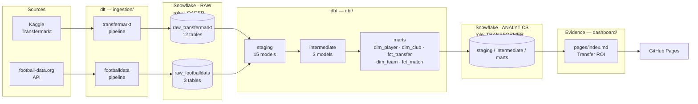
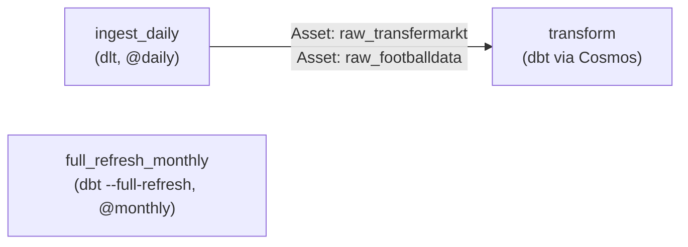

# Architecture

This document explains how Mercato Analytics fits together and, more importantly,
*why* it's built this way — the design decisions below came out of real constraints
hit while building the project, not upfront theorizing. For conventions and
day-to-day commands, see [`CLAUDE.md`](./CLAUDE.md) and each module's own README.

## System overview

Both `PIPELINE_SVC` roles (`LOADER`, `TRANSFORMER`) are the same Snowflake
**SERVICE** user — least privilege is enforced by which role is active on a given
connection, not by which user connects (see decision 2 below).

## Orchestration

Three Airflow DAGs (Astronomer, `orchestration/dags/`), scheduled with
[Asset](https://airflow.apache.org/docs/apache-airflow/stable/authoring-and-scheduling/assets.html)-based
data-awareness rather than fixed times chained together:

`transform`'s task graph is generated entirely from the dbt project's
`ref()`/`source()` lineage by Cosmos — no hand-written task ordering.
`full_refresh_monthly` exists for when a mart eventually goes `incremental`; nothing
currently needs it.

## CI/CD

- **`.github/workflows/ci.yml`** — on every PR: `sqlfluff lint` then `dbt build
  --target ci`, both against live Snowflake (as `PIPELINE_SVC`).
- **`.github/workflows/deploy-dashboard.yml`** — on push to `main` touching
  `dashboard/**`: rebuilds the Evidence site against live data and publishes to
  GitHub Pages.

## Key design decisions

### 1. ROI transfert: two indicators, not one score

`fct_transfer` exposes `roi_financier` (market-value gain during the spell,
relative to the fee paid) and `cost_per_goal_contribution` (fee paid relative to
goals + assists) as **separate columns**, not blended into one weighted score.

**Why:** merging money and sporting performance into a single number needs an
arbitrary weighting scheme (why 60/40 and not 50/50?) that's hard to justify and
impossible to unit-test meaningfully. Two independent numbers stay individually
interpretable, and each has a precise, testable formula — see the 3 dbt unit tests
in `dbt/models/marts/_marts__unit_tests.yml`.

### 2. Snowflake auth: key-pair + a dedicated SERVICE user

Every pipeline (dlt, dbt, Airflow, Evidence) authenticates as `PIPELINE_SVC`
(`TYPE = SERVICE`, RSA key only — Snowflake doesn't allow a password on a SERVICE
user at all), never as the personal account.

**Why:** the Snowflake trial enforces MFA on password logins, which blocks
password-based automation outright. Key-pair auth was the fix — but it was
initially attached to the personal person account, which Snowflake's own Trust
Center later flagged as a "person user, password-only auth" risk (the real
problem: mixing a human identity with an automation identity). A dedicated SERVICE
user is Snowflake's documented pattern for exactly this, and structurally can't
regress into password auth. See `snowflake/setup.sql`.

### 3. dbt orchestrated via Cosmos-in-Airflow, not dbt Cloud

dbt runs locally (interactive dev) and via
[Cosmos](https://astronomer.github.io/astronomer-cosmos/) inside self-hosted
Airflow — no dbt Cloud account.

**Why:** portfolio scope. dbt Cloud is a fine choice generally, but adding a second
managed SaaS here wouldn't demonstrate anything Cosmos doesn't already cover, and
building the Cosmos integration directly is more instructive for a project meant to
show modern-data-stack orchestration, not just consume it.

### 4. Freshness on dlt sources without a `loaded_at` column

Every source's freshness check uses
`loaded_at_field: to_timestamp_ntz(_dlt_load_id::number(38,0))` instead of a
dedicated timestamp column.

**Why:** dlt stores its internal load id as a stringified Unix epoch
(`_dlt_load_id`), not a human timestamp column, and none of the source tables carry
their own `loaded_at`. Casting the load id directly gives correct freshness checks
without adding a redundant column anywhere. See any `_*__sources.yml` under
`dbt/models/staging/`.

### 5. No identity resolution between Transfermarkt and football-data.org

`dim_club` (Transfermarkt) and `dim_team` (football-data.org) are two separate,
unlinked referentials for what are sometimes the same real-world clubs.

**Why:** fuzzy-matching club (and eventually player) names across sources
correctly is a project of its own — normalizing "Bayern Munich" vs "FC Bayern
München" vs "Bayern München" reliably needs real work, and a half-done match would
silently corrupt joins rather than just being absent. Neither source blocks the
other for the current ROI use case, so this is deliberately deferred rather than
rushed.

### 6. FBref abandoned

There's no `ingestion/fbref/pipeline.py`, despite FBref being in the original
source list.

**Why:** FBref serves an interactive Cloudflare challenge (Turnstile) to every
automated request — confirmed independent of network/IP (tested from a residential
IP, not a datacenter range). Defeating it would mean deliberately circumventing an
active anti-bot measure on a site whose terms of service explicitly forbid
scraping. See `ingestion/fbref/README.md`.

### 7. Evidence: extract-then-cache, and a base-path gotcha

Each mart table the dashboard uses needs its own extraction file
(`dashboard/sources/mercato_analytics/<table>.sql`, e.g. `select * from
fct_transfer`). `npm run sources`/`build` runs these against live Snowflake and
caches the result as local parquet; **page queries run against that cache**, not
Snowflake directly at page-load time. Separately, `dashboard/evidence.config.yaml`
sets `deployment.basePath: /mercato-analytics`.

**Why:** this is simply how Evidence works (extract at build time, query the cache
client-side via DuckDB-wasm) — but it's not obvious from a page's markdown alone,
and skipping either piece fails silently and confusingly: no extraction file means
every page query 404s against an empty local DuckDB catalog; no base path means
GitHub Pages (which serves the site under `/mercato-analytics/`, not the domain
root) loads an unstyled page stuck on "Loading..." because every asset URL is
missing its prefix. Both were hit for real, not anticipated in advance.

### 8. Each CI job needs its own `dbt deps`

Both the `sqlfluff` and `dbt-build` jobs in `ci.yml` run `dbt deps`, even though
that looks redundant.

**Why:** each GitHub Actions job runs on its own fresh runner — packages
(`dbt_utils`) installed in one job's `dbt_packages/` don't exist in the other's.
Found by actually running the pipeline in a real PR (`dbt build` failed with "dbt
expects 1 package(s) ... found only 0"), not by inspection.

## Tech stack

| Layer | Tool | Notes |
|---|---|---|
| Ingestion | [dlt](https://dlthub.com/) | Python, `merge` write disposition |
| Warehouse | [Snowflake](https://www.snowflake.com/) | `RAW` + `ANALYTICS` databases, XS warehouse |
| Transformation | [dbt](https://www.getdbt.com/) | staging → intermediate → marts |
| Orchestration | [Airflow](https://airflow.apache.org/) via [Astronomer](https://www.astronomer.io/) | + [Cosmos](https://astronomer.github.io/astronomer-cosmos/) for dbt |
| Dashboard | [Evidence](https://evidence.dev/) | SvelteKit + DuckDB-wasm under the hood |
| CI/CD | GitHub Actions | sqlfluff, dbt build, Pages deploy |
| Auth | RSA key-pair, Snowflake SERVICE user | no passwords in any automated path |
